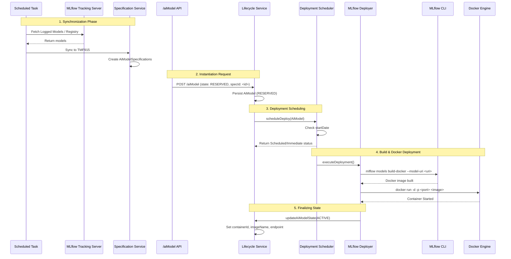

# AI Model Deployment Workflow

This document describes the end-to-end lifecycle of an AI model deployment in the TMF915 implementation, from synchronization with MLflow to the final Docker container spin-up.

## Flow Diagram



## Step-by-Step Details

### 1. Synchronization (MLflow → TMF915 Specifications)

* **Trigger:** A scheduled background task (`MlflowSyncService.syncModels()`) runs periodically.
* **Action:** It communicates with the MLflow tracking server using `MlflowClientService` and fetches either Logged Models or models from the classic Model Registry.
* **Outcome:** These MLflow objects are mapped and stored into the TMF915 catalog as **`AiModelSpecification`** entities via `MlflowSpecificationService`.

### 2. Model Instantiation Request (API Call)

* **Trigger:** A client makes a `POST /aiModel` request pointing to an existing `AiModelSpecification`.
* **Action:**
  * The payload state is requested as **`RESERVED`**.
  * The payload contains service characteristics indicating the `platform` (e.g., `"mlflow"`) and optionally targeting a specific Docker environment (e.g., `dockerHost`).
* **Outcome:** `AiModelApiController` accepts the request and delegates it to `AiModelLifecycleService`. The model is saved to the database in a `RESERVED` state.

#### Example API Call

```http
POST /aiModel
Content-Type: application/json;charset=utf-8

{
  "name": "my-ai-model-deployment",
  "description": "Deploy from existing AiModelSpecification",
  "state": "reserved",
  "aiModelSpecification": {
    "id": "PUT_AI_MODEL_SPECIFICATION_ID_HERE"
  },
  "serviceCharacteristic": [
    {
      "name": "platform",
      "valueType": "string",
      "value": "mlflow"
    },
    {
      "name": "dockerHost",
      "valueType": "string",
      "value": "tcp://your.docker.host:2375" 
    },
    {
      "name": "mlflowModelId",
      "valueType": "string",
      "value": "PUT_LOGGED_MODEL_ID_HERE"
    }
  ]
}
```

**Explanation of key fields:**

1. **`state: "reserved"`**: Tells the `AiModelLifecycleService` that the instantiation is ready to be transitioned into a deployment schedule. Once Docker spins up the container, the system automatically transitions this state to `active`.
2. **`aiModelSpecification.id`**: The UUID of the specification that was previously synced from MLflow to TMF915.
3. **`serviceCharacteristic`**:
    * `"platform": "mlflow"` -> Informs `DeploymentScheduler` to use the `MlflowDeployer` logic.
    * `"dockerHost"` -> *(Optional)* If provided, routes the Docker commands to a specific remote Docker engine URI. If absent, the backend falls back to its configured default target.
    * `"mlflowModelId"` -> Instructs the deployer to pull the specific MLflow logged model. *(Note: If you use the classic Model Registry approach instead, you would provide the `"mlflowModelName"` and `"mlflowModelVersion"` characteristics rather than the `mlflowModelId`)*.

### 3. Deployment Scheduling

* **Trigger:** `AiModelLifecycleService` detects the `RESERVED` state transition.
* **Action:** It passes the model to the `DeploymentScheduler` (`scheduleDeploy()`).
* **Outcome:** If the `startDate` is immediate (or passed), it proceeds right away. If the `startDate` is in the future, it schedules a background task to run at that time.

### 4. Build & Docker Deployment

* **Trigger:** The scheduled task fires and invokes `executeDeployment()`.
* **Action:**

  * The scheduler finds the matching `PlatformDeployer` (which is `MlflowDeployer` based on the `"mlflow"` platform characteristic).
  * `MlflowDeployer` delegates to `MlflowModelService` and `MlflowDeploymentService`.
  * **Build Phase (`buildImageFromUri`):** A Java `ProcessBuilder` executes the MLflow CLI command to construct a Docker image for the model (if the image does not already exist):

  ```bash
  mlflow models build-docker --model-uri <mlflow-uri> --name <image-name> --env-manager <manager>
  ```

  * **Run Phase (`deployContainer`):** A subsequent Java `ProcessBuilder` runs standard Docker CLI commands to spin up the container, scanning for available ports if none was explicitly specified:

  ```bash
  docker run -d -p <host-port>:<container-port> --name <container-name> <image-name>
  ```

### 5. Finalizing State

* **Trigger:** Docker run completes successfully.
* **Action:** `MlflowModelService` invokes `updateModelAfterDeploy()`.
* **Outcome:** The `AiModel` entity is updated to the **`ACTIVE`** state. Characteristics such as `containerId`, `imageName`, `endpoint`, and an `inferencePayloadExample` are attached to the model so consumers can start interacting with the model immediately.
