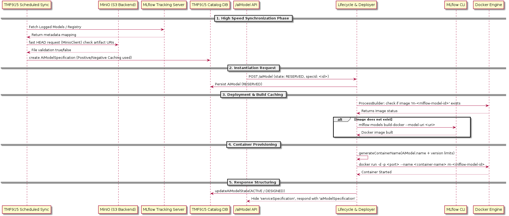

# AI Model Deployment Workflow & Developer Guide

This document describes the end-to-end lifecycle of an AI model deployment in the TMF915 implementation. It provides structural visibility into the optimization logic, mapping behaviors, and container orchestration flows between the Spring Boot application and the MLflow Tracking Server.

## Architecture & Communication Flow

## Internal Domain Mechanics

### 1. High-Performance Synchronization

Instead of naively fetching models using inefficient Python binaries, the `MlflowSyncService` utilizes direct Java-to-S3 integration for rapid synchronization.

* **Dual Compatibility:** The fetch logic cascades through two endpoints: the newer **MLflow 2.x Logged Models API**, rolling back to the **Classic Model Registry API** if unavailable.
* **Positive Cache (Passive):** Once an `AiModelSpecification` is cataloged, its `{experimentName}/{modelId}` key sits permanently inside `ConcurrentHashMap.newKeySet()`. Subsequent sync cycles bypass database index scanning entirely.
* **Negative Cache (Active Backoff):** Models that are logged but lack backing tracking files in MinIO (e.g. S3 deletion out of band) suffer a 10-minute penalty logic. S3's `io.minio.MinioClient.statObject` ensures HTTP `HEAD` operations validate actual presence with millisecond latency, actively dodging missing logs. 

### 2. Model Instantiation API Handling

When a client executes a `POST /aiModel` payload targeting an `AiModelSpecification`:

* The application isolates TMF 638 `Service` inheritance models from TMF 915 models using `@JsonIgnore` specifically over the `serviceSpecification` mapping. This ensures payloads exclusively communicate native `aiModelSpecification` identities without duplicating blocks.
* Setting `"state": "reserved"` automatically assigns the deployment to `DeploymentScheduler.executeDeployment(AiModel)`.

### 3. Build Optimization & Container Naming Maps

To achieve horizontal model scales (spawning identical containers rapidly) without blocking CPU time recompiling identical ML Docker environments:

1. **Docker Image Identity (`imageName`):**
   * Driven exclusively by the MLflow Object Hash, formatted rigidly via `sanitizeImageName(modelId)` keeping its MLflow signature (e.g., `m-846ff5a9b35e...`).
   * TMF915 queries Docker explicitly to see if `m-846ff5a9b35e...` already lives on the host. If true, `mlflow models build-docker` is universally bypassed.
2. **Docker Container Identity (`containerName`):**
   * Evaluated uniquely per scale-out occurrence.
   * `MlflowModelService.generateContainerName()` combines the developer's requested `AiModel.name` value with its associated semantic versioning limits or truncates a random 8-string ID slice if not sufficiently supplied.
   * *Example Output Pattern:* `my-ai-model-name-v846ff5a9b35e..` vs pure Image `m-846ff...`

### 4. Lifecycle Finalization & Reversion Strategy

Depending heavily on network stability and the Docker Daemon socket capabilities (`tcp://host:2375` or `/var/run/docker.sock`), failures do occur. 

* **ACTIVE Transitions:**
   Upon successful network socket binding on standard interface port scans (`0.0.0.0:3000 -> 8080`), traits tracking specific topological attributes, including `hostPort`, `dockerHost`, `imageName` and an executable `inferencePayloadExample`, are patched directly into the `AiModel` instance entity dynamically. TMF915 commits `ACTIVE` states simultaneously.
* **DESIGNED Transitions:**
   Upon failing to resolve dependencies (e.g. MinIO connectivity drop to Docker container `build-docker`), the service downgrades the operational entity from `RESERVED` directly cleanly into `DESIGNED`. The exception Java stacktrace executes an unparsed drop directly to the `AiModel.Note` array alerting users natively.
